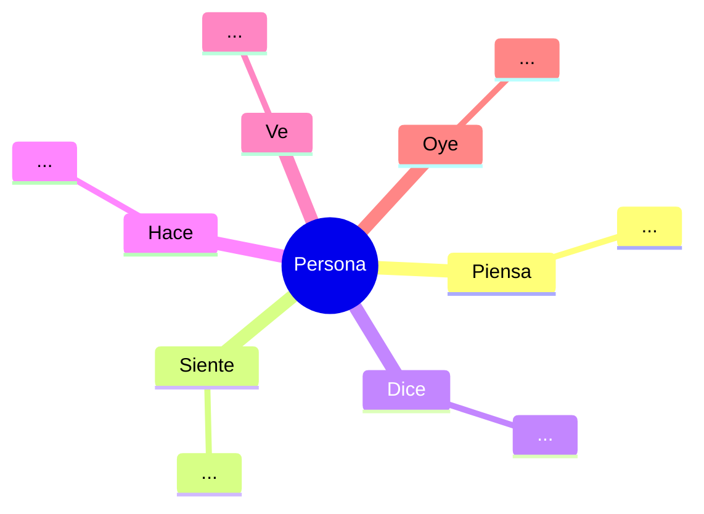

# PERSONA_XXX — [Nombre ficticio memorable]

> 💡 **Una línea de contexto**: ¿Quién es, qué hace y por qué nos importa?
> _Ej: "Doña Rosa es dueña de un minimarket hace 18 años. Trabaja con un cuaderno y le tiene más miedo al cuadre de caja que a una inspección del SII."_

---

## 🧍 Identidad

| Campo                    | Valor |
| ------------------------ | ----- |
| **Nombre ficticio**      |       |
| **Edad**                 |       |
| **Género**               |       |
| **Ciudad / Comuna**      |       |
| **Nivel socioeconómico** |       |
| **Educación**            |       |
| **Composición familiar** |       |

---

## 🏪 Contexto del Negocio (si aplica)

| Campo                   | Valor                                                  |
| ----------------------- | ------------------------------------------------------ |
| **Tipo de negocio**     | minimarket · ferretería · botillería · restorán · otro |
| **Antigüedad**          |                                                        |
| **Tamaño**              | m²                                                     |
| **Empleados**           | ¿cuántos? ¿rotativos?                                  |
| **Ticket promedio**     | $                                                      |
| **Volumen**             | ventas/mes                                             |
| **Sistema actual**      | cuaderno · Excel · software X · nada                   |
| **Factura formalmente** | sí · no · a veces                                      |

---

## 🎯 Objetivos y Motivaciones

> ¿Qué quiere lograr esta persona? Pensar en metas concretas, no abstractas.

1. ...
2. ...
3. ...

**Frase que resume su norte**:

> _"...para que mis hijos puedan..." / "...para no tener que preocuparme de..."_

---

## 😰 Frustraciones y Dolores (Top 5)

> Lo que le quita el sueño. Ordenar de mayor a menor impacto.

| #   | Dolor | Impacto | Cita textual |
| --- | ----- | ------- | ------------ |
| 1   |       | alto    | _"..."_      |
| 2   |       | medio   | _"..."_      |
| 3   |       | bajo    | _"..."_      |

---

## 😟 Miedos y Riesgos Percibidos

- **M1**: ...
- **M2**: ...
- **M3**: ...

> _Ej: "Si instalo un software y se cae, pierdo ventas. Por eso sigo con el cuaderno."_

---

## ✅ Jobs To Be Done

```yaml
funcionales:
  - 'Cuando [contexto], quiero [acción], para [resultado medible].'

emocionales:
  - 'Quiero sentir [emoción] cuando [situación].'

sociales:
  - 'Quiero que [audiencia: familia, clientes, proveedores] piense/perciba [X].'
```

---

## 📱 Comportamiento Digital

| Campo                              | Valor                                 |
| ---------------------------------- | ------------------------------------- |
| **Dispositivo principal**          | Android gama baja · iPhone · notebook |
| **Apps que usa diariamente**       | WhatsApp, Facebook, ...               |
| **Redes sociales**                 |                                       |
| **Banca online**                   | sí · no · "no me atrevo"              |
| **Comercio online (compró algo)**  | sí · no                               |
| **Usa apps del banco**             | sí · no                               |
| **Sabe escanear QR**               | sí · no                               |
| **Tiene datos móviles confiables** | sí · a veces · no                     |

---

## 🛒 Comportamiento de Compra (B2B: del SaaS)

> Esta persona, ¿cómo toma la decisión de comprar un software?

| Pregunta                                       | Respuesta                                     |
| ---------------------------------------------- | --------------------------------------------- |
| **¿Quién decide comprar tecnología?**          | ella misma · su hijo · contador               |
| **Presupuesto mensual para tecnología**        | $ 0 · $5.000 · $20.000 · $50.000              |
| **¿Cuánto tiempo investiga antes de comprar?** | horas · días · semanas                        |
| **Canal de descubrimiento**                    | Facebook · recomendación · Google · Instagram |
| **Objeción #1 típica**                         | _"y si no funciona?"_                         |
| **Trigger de compra**                          | _"cuando X pase"_                             |

---

## 🚶 Customer Journey Típico

> El "día en la vida" de esta persona relacionado con el problema que resolvemos.

```
07:00  ...
09:00  ...
13:00  ...
18:00  ...
21:00  ...
```

**Momento de falla típico (failure moment)**: ...

---

## 💬 Quotes Memorables

> Frases reales (o plausibles) que haya dicho en entrevistas. Son ORO para marketing.

> _"..."_

> _"..."_

---

## 🗺️ Mapeo de Empatía



---

## 🎯 Cómo le hablamos (Tone of Voice)

| ❌ NO decir                   | ✅ SÍ decir |
| ----------------------------- | ----------- |
| _"API REST"_                  | _"..."_     |
| _"Sincronización en la nube"_ | _"..."_     |
| _"..."_                       | _"..."_     |

---

## 📊 Métricas de Éxito para esta Persona

- **M1**: ...
- **M2**: ...
- **M3**: ...

---

## 🔗 Vínculos

- **Casos de uso relacionados**: [[UC_XXX]], [[UC_XXX]]
- **Hipótesis a validar**: [[H_XXX]]
- **Feature priorizada para esta persona**: [[US_XXX]]
- **Anti-persona** (la persona para quien NO diseñamos): ...

---

## 📝 Notas y Evidencia

> Pegar acá: fotos, capturas de WhatsApp, transcripciones, links a videos.

```
[Espacio libre para evidencia cruda]
```

---

## ✅ Checklist de Persona Completa

- [ ] Tiene nombre ficticio memorable
- [ ] Tiene 3+ dolores cuantificados
- [ ] Tiene al menos 1 JBTD funcional, 1 emocional, 1 social
- [ ] Tiene al menos 2 quotes textuales
- [ ] Tiene comportamiento digital documentado
- [ ] Tiene comportamiento de compra B2B documentado
- [ ] Está vinculada a ≥1 caso de uso
